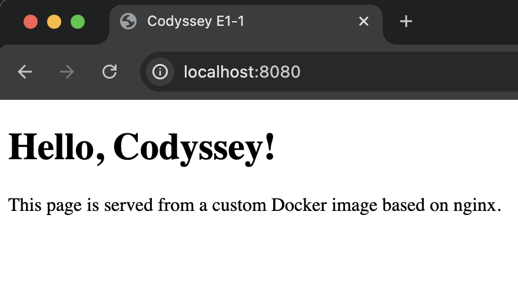
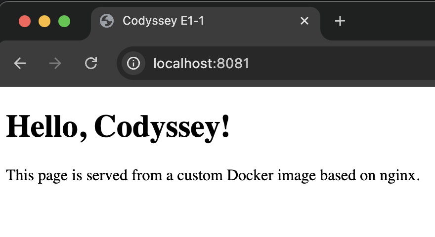
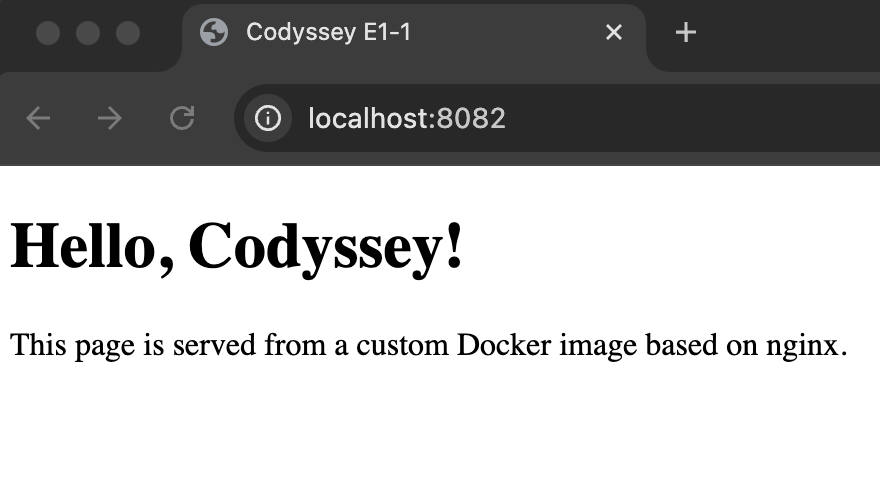
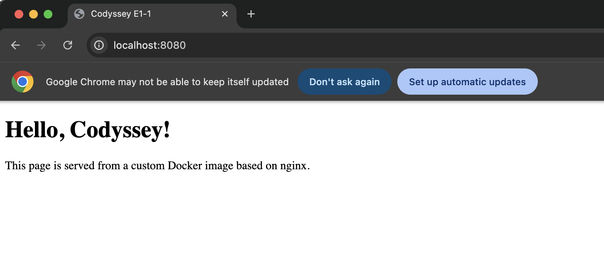
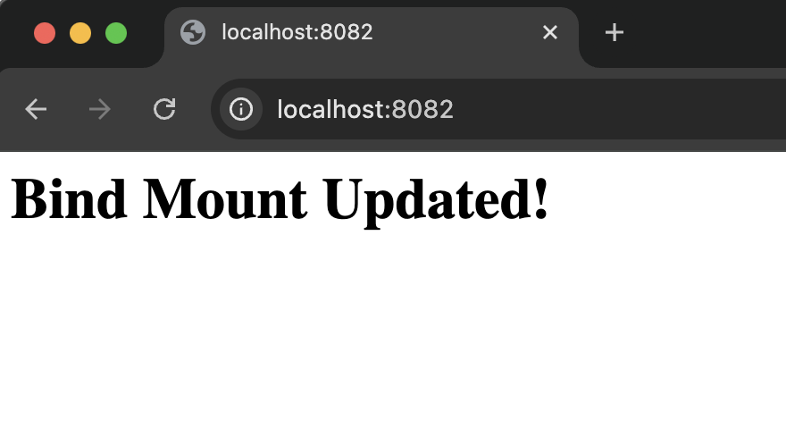

# E1-1. AI/SW 개발 워크스테이션 구축


## 프로젝트 개요

- [1. 터미널 기본 명령어 & 권한 부여](#1-터미널-기본-명령어--권한-부여)
- [2. Docker 기본 명령어 & 실습](#2-docker-기본-명령어--실습)
- [3. Dockerfile 기반 커스텀 이미지 제작](#3-dockerfile-기반-커스텀-이미지-제작)
- [4. 포트 매핑](#4-포트-매핑)
- [5. 바인드 마운트 및 볼륨 영속성](#5-바인드-마운트-및-볼륨-영속성)
- [6. Git 설정 및 연동](#6-git-설정-및-연동)
- [7. Docker Compose](#7-docker-compose)
- [8. 트러블 슈팅](#8-트러블-슈팅)

------

### 실행 환경

- OS: Sequoia 15.7.4
- Shell: zsh
- Docker version: 28.5.2
- Git version:

### 수행항목 체크리스트

- [x] 터미널 기본 조작 및 폴더 구성
- [x] 권한 변경 실습
- [x] Docker 설치/점검
- [x] hello-world 실행
- [x] Dockerfile 빌드/실행
- [x] 포트 매핑 접속(2회)
- [x] 바인드 마운트 반영
- [x] 볼륨 영속성
- [ ] Git 설정 + VSCode GitHub 연동

------

## 1. 터미널 기본 명령어 & 권한 부여

### 1.1 터미널 기본 명령어 정리

| 명령어 | 기능 | 사용 예시 | 설명 |
|--------|------|----------|------|
| `pwd` | 현재 디렉토리 경로 확인 | `pwd` | 현재 작업 중인 위치를 절대경로로 출력 |
| `ls` | 디렉토리 목록 확인 | `ls` | list 현재 폴더 내 파일 및 디렉토리 출력 |
| `ls -la` | 숨김 파일 포함 상세 목록 | `ls -la` | 권한, 소유자, 크기 등 상세 정보 확인 |
| `cd` | 디렉토리 이동 | `cd practice/` | 특정 폴더로 이동 |
| `cd ..` | 상위 디렉토리 이동 | `cd ..` | 한 단계 위 폴더로 이동 |
| `mkdir` | 디렉토리 생성 | `mkdir test` | 새로운 폴더 생성 |
| `touch` | 파일 생성 | `touch file.txt` | 빈 파일 생성 |
| `cat` | 파일 내용 출력 | `cat file.txt` | 파일 내용을 터미널에 출력 |
| `echo` | 문자열 출력/파일 쓰기 | `echo "hi" > file.txt` | 파일에 내용 작성 |
| `cp` | 파일 복사 | `cp a.txt b.txt` | 파일 복제 |
| `mv` | 파일 이동/이름 변경 | `mv a.txt b.txt` | 파일 이름 변경 또는 이동 |
| `rm` | 파일 삭제 | `rm file.txt` | 파일 삭제 |
| `rm -r` | 디렉토리 삭제 | `rm -r folder` | 폴더 및 내부 파일 삭제 |

### 1.2 현재 위치 확인

```bash
$ pwd
/Users/east1111/ia-codyssey/e1/e1-1-workstation-setup
```

### 1.3 파일과 디렉토리 목록과 권한 확인

```bash
$ ls -la
사용자명@호스트명(혹은 ip주소)  e1-1-workstation-setup % ls -la
total 8 # 현재 디렉토리의 전체 용량: 8블록(8x512byte)
drwxr-xr-x  3 east1111  east1111    96 Apr  4 16:12 .
drwxr-xr-x  3 east1111  east1111    96 Apr  4 16:12 ..
-rw-r--r--  1 east1111  east1111  1618 Apr  4 17:55 README.md
```
- 첫 글자는 파일타입 `d` = 디렉토리, `-` = 일반 파일, `l` = 링크 `r` = read/4, `w` = write/2, `x` = execute/1    
- 1그룹: 소유자(Owner) 2그룹: 그룹(Group) 3그룹: 그 외 모든 사람(Others)   
- `ls`: 파일/폴더 이름만 표시, `-l`: 권한, 크기, 수정일 표시, `-a`: 숨김파일(`.`으로 시작) 표시, `-lh`: 파일 크기 kb, mb단위로 표시


### 1.4 디렉토리 생성 및 이동

```bash
east1111@0000 e1-1-workstation-setup % mkdir hi # hi 디렉토리 생성
east1111@0000 e1-1-workstation-setup % ls      # 디렉토리 생성 확인
hi              README.md
east1111@0000 e1-1-workstation-setup % cd hi   # 디렉토리 이동
east1111@0000 hi % pwd                         # 현재 위치 확인
/Users/east1111/ia-codyssey/e1/e1-1-workstation-setup/hi
```

### 1.5 파일 생성 및 내용 추가, 확인

```bash
east1111@0000 hi % touch hello.txt # 파일 생성
east1111@0000 hi % cat hello.txt   # 파일 내용 확인 -> 비어있음
east1111@0000 hi % echo "hello codyssey!" > hello.txt # 파일 내용 추가
dquote>    
east1111@0000 hi %   # !와 "가 붙어 히스토리 확장으로 잘못 해석 -> 자세한 내용 트러블 슈팅 항목 참고
east1111@0000 hi % echo 'hello codyssey!' > hello.txt # 큰따옴표(")를 작은따옴표(')로 교체해 해결
east1111@0000 hi % cat hello.txt # 파일 내용 확인
hello codyssey!
```

### 1.6 파일 복사, 이름 변경, 제거

```bash
east1111@0000 hi % cp hello.txt copy.txt # 파일 복사
east1111@0000 hi % ls # 리스트 확인
copy.txt        hello.txt
east1111@0000 hi % mv copy.txt renamed.txt # 파일 이름 변경
east1111@0000 hi % ls # 이름 변경 확인
hello.txt       renamed.txt
east1111@0000 hi % cd .. # 상위 디렉토리로 이동
east1111@0000 e1-1-workstation-setup % rm -r hi # 디렉토리 삭제
east1111@0000 e1-1-workstation-setup % ls # 삭제 확인
README.md
```
`rm` 파일삭제, `-r` 폴더삭제, `-f` 강제삭제, `-i` 삭제 전 확인

### 1.7 파일 권한 변경

```bash
east1111@0000 e1-1-workstation-setup % touch file.txt # 파일 생성
east1111@0000 e1-1-workstation-setup % ls -la # 파일 권한 확인
total 16
drwxr-xr-x  4 east1111  east1111   128 Apr  4 19:07 .
drwxr-xr-x  3 east1111  east1111    96 Apr  4 16:12 ..
-rw-r--r--  1 east1111  east1111     0 Apr  4 19:07 file.txt
-rw-r--r--  1 east1111  east1111  4798 Apr  4 18:48 README.md
east1111@0000 e1-1-workstation-setup % chmod 755 file.txt # 파일 권한 변경
east1111@0000 e1-1-workstation-setup % ls -la # 파일 권한 확인
total 16
drwxr-xr-x  4 east1111  east1111   128 Apr  4 19:07 .
drwxr-xr-x  3 east1111  east1111    96 Apr  4 16:12 ..
-rwxr-xr-x  1 east1111  east1111     0 Apr  4 19:07 file.txt
-rw-r--r--  1 east1111  east1111  4798 Apr  4 18:48 README.md
```

### 1.8 디렉토리 권한 변경

```bash
east1111@0000 e1-1-workstation-setup % mkdir test # 디렉토리 생성
east1111@0000 e1-1-workstation-setup % ls -ld test # 디렉토리 권한 확인(-d는 폴더 자체 정보만 표시)
drwxr-xr-x  2 east1111  east1111  64 Apr  4 19:14 test 
east1111@0000 e1-1-workstation-setup % chmod 700 test # 권한 변경
east1111@0000 e1-1-workstation-setup % ls -ld test # 권한 확인
drwx------  2 east1111  east1111  64 Apr  4 19:14 test
```
`u+x` 소유자에게 실행권한 추가, `g-w` 그룹에서 쓰기 권한 제거, `o=r` 다른사람 권한 읽기만으로 지정, `a+r` 모두에게 읽기 권한 추가      
`chmod -R 755 test` 폴더 안의 모든 파일/폴더까지 한 번에 변경

## 2. Docker 기본 명령어 & 실습

### 2.1.1 Docker 기본 명령어 정리

| 명령어 | 기능 | 사용 예시 | 설명 |
|--------|------|----------|------|
| `docker --version` | Docker 버전 확인 | `docker --version` | Docker CLI 설치 여부 및 버전 확인 |
| `docker info` | Docker 엔진 상태 확인 | `docker info` | Docker 데몬 실행 여부 및 시스템 정보 확인 |
| `docker images` | 이미지 목록 조회 | `docker images` | 로컬에 저장된 이미지 확인 |
| `docker pull` | 이미지 다운로드 | `docker pull ubuntu` | Docker Hub에서 이미지 가져오기 |
| `docker ps` | 실행 중 컨테이너 조회 | `docker ps` | 현재 실행 중인 컨테이너 확인 |
| `docker ps -a` | 전체 컨테이너 조회 | `docker ps -a` | 중지된 컨테이너 포함 전체 조회 |
| `docker run` | 컨테이너 실행 | `docker run [옵션] <이미지ID> [실행명령]` | 이미지 기반으로 컨테이너 생성 및 실행 |
| `docker run -it` | 인터랙티브 실행 | `docker run -it ubuntu bash` | 터미널에서 직접 컨테이너 접근 |
| `docker run -d` | 백그라운드 실행 | `docker run -d nginx` | 컨테이너를 백그라운드로 실행 |
| `docker stop` | 컨테이너 중지 | `docker stop <컨테이너ID>` | 실행 중인 컨테이너 종료 |
| `docker rm` | 컨테이너 삭제 | `docker rm <컨테이너ID>` | 중지된 컨테이너 삭제 |
| `docker rmi` | 이미지 삭제 | `docker rmi <이미지ID>` | 로컬 이미지 삭제 |
| `docker logs` | 로그 확인 | `docker logs <컨테이너ID>` | 컨테이너 실행 로그 확인 |
| `docker stats` | 리소스 사용 확인 | `docker stats` | CPU, 메모리 등 사용량 확인 |

### 2.1.2 docker run 주요 옵션

| 옵션 | 의미 | 설명 |
|------|------|------|
| `-d` | detached mode | 백그라운드 실행 |
| `-it` | interactive terminal | 터미널 인터랙션 가능 |
| `--name` | 컨테이너 이름 지정 | 컨테이너 식별을 쉽게 함 |
| `-p` | 포트 매핑 | 호스트:컨테이너 포트 연결 |
| `--rm` | 자동 삭제 | 종료 시 컨테이너 자동 삭제 |

### 2.2 Docker 버전 및 상태 확인

 ```bash
east1111@c1111 e1-1-workstation-setup % docker --version # 도커 버전 확인
Docker version 28.5.2, build ecc6942
east1111@c1111 e1-1-workstation-setup % docker info # 도커 엔진 상태 확인
Client:
 Version:    28.5.2
 Context:    orbstack
 Debug Mode: false
 Plugins:
  buildx: Docker Buildx (Docker Inc.)
    Version:  v0.29.1
                    ----이하생략----

east1111@c1111 e1-1-workstation-setup % docker images # 이미지 목록 (현재 없음)
REPOSITORY   TAG       IMAGE ID   CREATED   SIZE

east1111@c1111 e1-1-workstation-setup % docker ps -a  # 컨테이너 목록 조회 (-a: 종료된 것 포함) (현재 없음)
CONTAINER ID   IMAGE     COMMAND   CREATED   STATUS    PORTS     NAMES
```
- `docker info` 명령 시  
`Containers` 전체/실행 중/정지된 컨테이너 개수, `Images` 설치된 이미지 개수, `Server Version` Docker 엔진 버전, `Storage Driver` 사용 중인 스토리지 드라이버,   
`Logging Driver` 컨테이너 로그 저장 방식, `Cgroup Driver / Version` 리소스 제어 방식, `Plugins` 네트워크/볼륨/로그 플러그인 정보, `Swarm` Docker Swarm 활성화 여부,  
`Runtimes` 사용 가능한 컨테이너 런타임 정보, `Default Runtime` 기본 런타임, `OS / Architecture` 운영체제 및 CPU 아키텍처, `CPUs / Total Memory` 시스템 자원 정보,  
`Docker Root Dir` Docker 데이터 저장 위치, `Network` 브리지 등 네트워크 설정 정보

### 2.3 hello-world 실행

 ```bash
east1111@c1111 e1-1-workstation-setup % docker run hello-world # hello-world 실행
---생략---
Hello from Docker!
This message shows that your installation appears to be working correctly.
---생략---
east1111@c1111 e1-1-workstation-setup % docker ps -a # 컨테이너 실행 결과 확인
CONTAINER ID   IMAGE         COMMAND    CREATED         STATUS                     PORTS     NAMES
395f6b60557b   hello-world   "/hello"   3 minutes ago   Exited (0) 3 minutes ago             hungry_rosalind
```

### 2.4 Ubuntu 컨테이너 실행

 ```bash
east1111@c1111 e1-1-workstation-setup % docker run -it ubuntu bash # 우분투 컨테이너 실행 및 내부 진입(-it: 터미널 인터랙션, bash: 컨테이너 내부 쉘 실행)
Unable to find image 'ubuntu:latest' locally
latest: Pulling from library/ubuntu
...........
Status: Downloaded newer image for ubuntu:latest
root@1234:/# ls # 리눅스 명령어 사용가능
bin  boot  dev  etc  home  lib  lib64  media  mnt  opt  proc  root  run  sbin  srv  sys  tmp  usr  var
root@1234:/# echo "hello docker" 
hello docker
root@1234:/# exit # 컨테이너 종료 (bash 종료시 함께 종료)
exit
east1111@c1111 e1-1-workstation-setup % docker ps -a # 종료된 컨테이너 확인 *exited(0): 정상 종료 의미
CONTAINER ID   IMAGE         COMMAND    CREATED          STATUS                     PORTS     NAMES
1234   ubuntu        "bash"     27 seconds ago   Exited (0) 5 seconds ago             exciting_goldwasser
395f6b60557b   hello-world   "/hello"   6 minutes ago    Exited (0) 6 minutes ago             hungry_rosalind            hungry_rosalind
```

### 2.5 이미지와 컨테이너의 차이

| 구분 | 이미지 (Image) | 컨테이너 (Container) |
|------|----------------|----------------------|
| 개념 | 실행을 위한 템플릿 (설계도) | 이미지 기반으로 생성된 인스턴스 |
| 생성 방식 | `docker build`, `docker pull` | `docker run` |
| 빌드 | Dockerfile통해 빌드되거나 외부에서 pull | 이미지를 기반으로 생성됨 (빌드 개념 없음) |
| 실행 | 실행 불가 (정적 상태) | 실행 가능 (동적 상태) |
| 변경 가능 여부 | ❌ 불변 | ⭕ 변경 가능 (파일 수정, 상태 변화) |
| 재사용성 | 여러 컨테이너에서 공유 | 개별 컨테이너마다 독립 |
| 삭제 시 영향 | 삭제해도 기존 컨테이너 유지 가능 | 삭제하면 실행 상태 사라짐 |
- `Dockerfile` -> `build`: 이미지생성 -> `Image` -> `run`: 컨테이너 생성 -> `Container`

### 2.6 컨테이너 종료/유지 명령어

| 구분 | attach | exec |
|------|--------|------|
| 명령어 | `docker attach <컨테이너>` | `docker exec -it <컨테이너> bash` |
| 개념 | 기존 실행 중인 프로세스에 직접 연결 | 실행 중인 컨테이너 내부에 새 프로세스 실행 |
| 연결 대상 | 컨테이너의 기본 프로세스(stdin/stdout) | 새로운 shell 또는 명령 |
| 컨테이너 상태 영향 | ⭕ 직접 영향 있음 | ❌ 영향 없음 (독립 실행) |
| 종료 시 동작 | 종료하면 컨테이너도 종료될 수 있음 | 종료해도 컨테이너는 계속 실행 |
| 사용 목적 | 기존 실행 상태 모니터링 | 컨테이너 내부 점검, 파일 확인, 디버깅 |
| 안전성 | 낮음 (실수 시 컨테이너 종료 가능) | 높음 (컨테이너 유지됨) |

- `attach`는 컨테이너의 메인 프로세스에 직접 연결되므로 종료 시 컨테이너에도 영향을 줄 수 있다.
- `exec`은 컨테이너 내부에 새로운 프로세스를 실행하는 방식으로 종료해도 컨테이너는 계속 유지된다.

#### attach와 exec 비교 실습

```bash
east1111@1234 e1-1-workstation-setup % docker run -dit --name test-ubuntu ubuntu bash # 컨테이너 실행(-d: 백그라운드 실행, -it 터미널 유지, bash를 메인 프로세스로 실행)
6e1441b9b98976cc8a0c626150070e192b85e8eaecdb1e253bf1f0ccc2403136
east1111@1234 e1-1-workstation-setup % docker attach test-ubuntu # attach로 연결
root@6e1441b9b989:/# echo "attach test"
attach test
root@6e1441b9b989:/# exit # attach 상태에서 종료
exit
east1111@1234 e1-1-workstation-setup % docker ps -a # 결과: 컨테이너도 함께 종료
CONTAINER ID   IMAGE             COMMAND                  CREATED          STATUS                     PORTS              NAMES
6e1441b9b989   ubuntu            "bash"                   37 seconds ago   Exited (0) 7 seconds ago                      test-ubuntu

east1111@1234 e1-1-workstation-setup % docker start test-ubuntu # 컨테이너 다시 실행
test-ubuntu
east1111@1234 e1-1-workstation-setup % docker exec -it test-ubuntu bash # exec로 연결
root@6e1441b9b989:/# echo "exec test"
exec test
root@6e1441b9b989:/# exit # exec 상태에서 종료
exit
east1111@1234 e1-1-workstation-setup % docker ps -a  # 결과: 컨테이너는 여전히 실행 중
CONTAINER ID   IMAGE             COMMAND                  CREATED              STATUS                     PORTS              NAMES
6e1441b9b989   ubuntu            "bash"                   About a minute ago   Up 34 seconds                                 test-ubuntu
```

## 3. Dockerfile 기반 커스텀 이미지 제작

- 이미지는 실행을 위한 템플릿이며, 컨테이너는 해당 이미지를 실제로 실행한 인스턴스. 
- 본 실습에서는 `Dockerfile`로 이미지를 빌드한 뒤, 이를 기반으로 웹 서버 컨테이너를 실행.

### 사용한 베이스 이미지
- `nginx:alpine`
- 경량 웹 서버 이미지를 베이스로 사용하여 정적 HTML 페이지를 서빙하도록 구성

### 커스텀 포인트
- `FROM nginx:alpine`: 기존 NGINX 이미지를 베이스로 사용
- `COPY src/index.html /usr/share/nginx/html/index.html` : 기본 웹 페이지를 내가 만든 HTML로 교체

### 파일 생성 및 빌드

 ```bash
east1111@1234 e1-1-workstation-setup % mkdir src              # src 디렉토리 생성
east1111@1234 e1-1-workstation-setup % touch src/index.html   # index.html 파일 생성
east1111@1234 e1-1-workstation-setup % touch Dockerfile       # dockerfile 생성
east1111@1234 e1-1-workstation-setup % docker build -t e1-1-custom-web . # 빌드
[+] Building 7.4s (7/7) FINISHED                                                                               docker:orbstack
 => [internal] load build definition from Dockerfile                                                                      0.2s
 => => transferring dockerfile: 265B                                                                                      0.0s
 => [internal] load metadata for docker.io/library/nginx:alpine                                                           2.7s
 => [internal] load .dockerignore                                                                                         0.1s
 => => transferring context: 2B                                                                                           0.0s
 => [internal] load build context                                                                                         0.2s
 => => transferring context: 373B                                                                                         0.0s
east1111@1234 e1-1-workstation-setup % docker images # 이미지 확인
REPOSITORY        TAG       IMAGE ID       CREATED         SIZE
e1-1-custom-web   latest    6f79f4492326   5 minutes ago   62.2MB
hello-world       latest    e2ac70e7319a   11 days ago     10.1kB
ubuntu            latest    f794f40ddfff   5 weeks ago     78.1MB
```

### 컨테이너 실행
```bash
east1111@1234 e1-1-workstation-setup % docker run -d -p 8080:80 --name e1-1-web e1-1-custom-web # 이미지 기반 컨테이너 실행
ae686c88cbe8a1bdfc7a80d5c6f42e8446ea92f996284d4ac653113de7662c08 # 컨테이너 ID
east1111@1234 e1-1-workstation-setup % curl http://localhost:8080 # curl 결과를 통해 정상 동작 확인
<!DOCTYPE html>
<html lang="en">
<head>
  <meta charset="UTF-8" />
  <meta name="viewport" content="width=device-width, initial-scale=1.0" />
  <title>Codyssey E1-1</title>
</head>
<body>
  <h1>Hello, Codyssey!</h1>
  <p>This page is served from a custom Docker image based on nginx.</p>
</body>
</html>%   
.........
```
### http://localhost:8080 접속 화면 


## 4. 포트 매핑

### 4.1 포트 매핑 개념

- 컨테이너는 기본적으로 외부와 격리된 네트워크 환경에서 실행됨
- 따라서 컨테이너 내부 서비스에 접근하려면 호스트와 포트를 연결해야함
- 동일한 이미지를 기반으로 여러 컨테이너를 서로 다른 포트에 동시 실행 가능

### 4.2 포트 매핑 실행

- `-p <호스트 포트>:<컨테이너 포트>` 형식으로 작성
```bash
east1111@1234 e1-1-workstation-setup % docker run -d -p 8080:80 --name web-8080 e1-1-custom-web # 8080:80 포트 매핑
f354d6e8d4f295efd480b3a92fab89f37e1b0f162e48c30e2fe37e7c5ccd7bea
east1111@1234 e1-1-workstation-setup % docker run -d -p 8081:80 --name web-8081 e1-1-custom-web # 8081:80 포트 매핑
10cd5e4abebaf3a51c14975a9a4a43ed1ae1e6339bc94cd5f0ae336afb0729fc
east1111@1234 e1-1-workstation-setup % docker ps # 현재 상태
CONTAINER ID   IMAGE             COMMAND                  CREATED          STATUS          PORTS                                     NAMES
10cd5e4abeba   e1-1-custom-web   "/docker-entrypoint.…"   9 seconds ago    Up 8 seconds    0.0.0.0:8081->80/tcp, [::]:8081->80/tcp   web-8081 
f354d6e8d4f2   e1-1-custom-web   "/docker-entrypoint.…"   37 seconds ago   Up 36 seconds   0.0.0.0:8080->80/tcp, [::]:8080->80/tcp   web-8080
```
#### 8080:80, 8081:80
 

## 5. 바인드 마운트 및 볼륨 영속성

### 5.1 바인트 마운트 개념

- 호스트 디렉토리를 컨테이너 내부에 연결
- 호스트에서 변경하면 컨테이너에 즉시 반영됨

### 5.2 바인드 마운트 실행

```bash
east1111@1234 e1-1-workstation-setup % docker run -d -p 8082:80 --name bind-web \  # 백그라운드 실행 및 8082:80 포트 매핑 및 이름 지정, \: 줄바꿈
> -v /Users/east1111/ia-codyssey/e1/e1-1-workstation-setup/src:/usr/share/nginx/html \  # -v: 볼륨, 호스트경로(/User/~):컨테이너경로(/usr/~)
> nginx:alpine # 이미지이름:태그, alpine은 가벼워서 실습이나 간단한 서버 띄울 때 주로 사용
5d5fbdc16cc68f0745886947932b4f09886c1c3185a23e8cfcfa771b06b3ee6d
east1111@1234 e1-1-workstation-setup % curl http://localhost:8082 
<!DOCTYPE html>
<html lang="en">
<head>
  <meta charset="UTF-8" />
  <meta name="viewport" content="width=device-width, initial-scale=1.0" />
  <title>Codyssey E1-1</title>
</head>
<body>
  <h1>Hello, Codyssey!</h1>
  <p>This page is served from a custom Docker image based on nginx.</p>
</body>
</html>%                       
```


#### html 수정
```bash
east1111@1234 e1-1-workstation-setup % echo '<h1>Bind Mount Updated!</h1>' > src/index.html # 코드 수정
east1111@1234 e1-1-workstation-setup % curl http://localhost:8082                           # 코드 반영 확인
<h1>Bind Mount Updated!</h1>
```
#### 바로 적용된 모습

- 컨테이너 재시작 없이 수정 즉시 서비스에 반영되는 점이 특징

### 5.3 볼륨 영속성

- 컨테이너를 지워도 볼륨에 저장한 데이터는 보존

```bash
east1111@1234 e1-1-workstation-setup % docker volume create my-volume # my-volume 볼륨 생성 (컨테이너 안이 아닌 도커 엔진이 별도 관리)
my-volume
east1111@1234 e1-1-workstation-setup % docker run -it --name volume-test -v my-volume:/data ubuntu bash # 컨테이너 생성 및 볼륨 연결
root@fb3b8e1b3211:/# echo 'persistent data' > /data/file.txt # 파일을 볼륨에 저장
root@fb3b8e1b3211:/# cat /data/file.txt # 파일 확인
persistent data
root@fb3b8e1b3211:/# exit # 컨테이너 종료
exit
east1111@1234 e1-1-workstation-setup % docker rm -f volume-test # 컨테이너 강제 삭제 
volume-test
east1111@1234 e1-1-workstation-setup % docker run -it --name volume-test-2 -v my-volume:/data ubuntu bash # 두번째 컨테이ㅣ너 생성 및 볼륨 연결
root@5010f4289955:/# cat /data/file.txt # 동일한 파일 확인 
persistent data
```

## 6. Git 설정 및 연동


## 7. Docker Compose


## 8. 트러블 슈팅

### [1] 히스토리 확장(History Expansion)으로 오인
| 구분 | 내용 |
|------|------|
| **문제** | `echo "hello codyssey!" > hello.txt` 입력 시 `dquote>` 가 나타나며 명령이 실행되지 않음 |
| **원인** | `!"` 에서 `!` 와 `"` 가 붙어있어 쉘이 닫는 따옴표를 제대로 인식하지 못함 |
| **해결** | 큰따옴표 `"` 대신 작은따옴표 `'` 사용: `echo 'hello codyssey!' > hello.txt` |